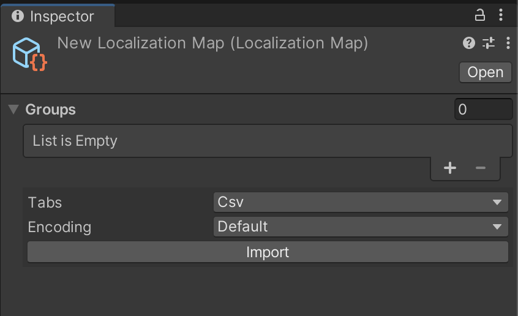

# Localization


## Description
The current package is designed to implement text localization in your Unity project. It demonstrates how to implement a system with minimal use of standard Unity classes, which significantly simplifies the code in the application.

The current package does not provide an option for saving the language, since this mechanics may change from project to project, due to different approaches to saving!

## Table of Contents
- [Getting Started](#Getting-Started)
    - [Install manually (using .unitypackage)](#Install-manually-(using-.unitypackage))
- [Basic Usage](#Basic-Usage)
    - [Create Map](#Create-Map)
    - [Editor Code](#Editor-Code)
    - [Runtime Code](#Runtime-Code)
- [License](#License)

## Getting Started
Prerequisites:
- [GIT](https://git-scm.com/downloads)
- [Unity](https://unity.com/releases/editor/archive) 2022.3+

### Install manually (using .unitypackage)
1. Download the .unitypackage from [releases](https://github.com/DanilChizhikov/Localization/releases/) page.
2. Open Localization.x.x.x.unitypackage

## Basic Usage

### Create Map

For to create a map, you need to right-click in the Project window and select the item in the drop-down menu `Create->Localization->Map`



The system supports working with several maps at once, in order to simplify the drawing of the inspector for each of the maps, thereby you can divide the localization into different sections of your project

### Editor Code

You can add custom tabs to load localizing tables, for this you need to create a new class in the Editor, which will be inherited from ISheetTab and describe its logic.
```csharp
using UnityEditor;

namespace MbsCore.Localization.Editor
{
    public interface ISheetTab
    {
        string TabName { get; }

        void DrawGui(SerializedProperty groupProperty);
    }
}
```

For Example
```csharp
namespace MbsCore.Localization.Editor
{
    internal sealed class ExampleSheetTab : ISheetTab
    {
        public string TabName => "Example";
        
        public void DrawGui(SerializedProperty groupProperty)
        {
            // some code...
        }
    }
}
```

### Runtime Code
First, you need to initialize the LocalizationService, this can be done using different methods.
Here we will show the easiest way, which is not the method that we recommend using!
```csharp
public class LocalizationServiceBootstrap : MonoBehaviour
{
    [SerializeField] private LocalizationMap[] _maps = Array.Empty<LocalizationMap>();

    private static ILocalizationService _service;

    public static ILocalizationService Service => _service;

    private void Awake()
    {
        if (_service != null)
        {
            Destroy(gameObject);
            return;
        }

        _service = new LocalizationService(_maps);
    }
}
```

In order to draw the localization key in the inspector, you can use the LocKeyAttribute.
It is important to remember that this attribute only works with fields of the string type

```csharp
public class Example : MonoBehaviour
{
    [SerializeField, LocKey] private string _locKey = string.Empty;
}
```

To track the language change, you can subscribe to the ILocalizationService event.
```csharp
public class Example : MonoBehaviour
{
    [SerializeField, LocKey] private string _locKey = string.Empty;

    private string _localizedString;
    private ILocalizationService _localizationService;

    [Inject]
    public void Construct(ILocalizationService localizationService)
    {
        _localizationService = localizationService;
        _localizationService.OnLanguageChanged += LanguageChangedCallback;
        LanguageChangedCallback(_localizationService.Language);
    }

    private void LanguageChangedCallback(SystemLanguage language)
    {
        _localizedString = _localizationService.GetTerm(_locKey);
    }

    private void OnDestroy()
    {
        if (_localizationService != null)
        {
            _localizationService.OnLanguageChanged -= LanguageChangedCallback;   
        }
    }
}
```

To change the language, you can use the following method from ILocalizationService

```csharp
public class Example : MonoBehaviour
{
    [SerializeField] private Button _englishButton = default;

    private string _localizedString;
    private ILocalizationService _localizationService;

    [Inject]
    public void Construct(ILocalizationService localizationService)
    {
        _localizationService = localizationService;
    }
    
    private void EnglishButtonCallback()
    {
        if (!_localizationService.TrySelectLanguage(SystemLanguage.English))
        {
            Debug.LogError("Could not select english!");
        }
    }

    private void Awake()
    {
        _englishButton.onClick.AddListener(EnglishButtonCallback);
    }
}
```

## License

MIT